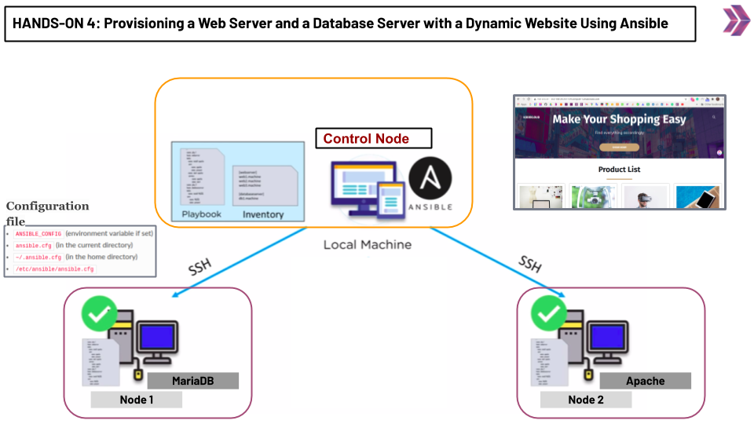

# Hands-on Ansible-05: Provisioning a Web Server and a Database Server with a Dynamic Website Using Ansible

The purpose of this hands-on training is to give students the knowledge of provisioning a web and database server with a dynamic website.

## Learning Outcomes

At the end of this hands-on training, students will be able to;

- Explain how to provision a web server using Ansible
- Explain how to provision a database server using Ansible




## Outline

- Part 1 - Build the Infrastructure (3 EC2 Instances with Red Hat Enterprise Linux 8 AMI)

- Part 2 - Install Ansible on the Controller Node

- Part 3 - Pinging the Target Nodes

- Part 4 - Install, Start and Enable MariaDB 

- Part 5 - Configure User Credentials and Database Schema

- Part 6 - Install, Start and Enable Apache Web Server and Other Dependencies

- Part 7 - Pull the Code and Make Necessary Changes

## Part 1 - Build the Infrastructure

- Get to the AWS Console and spin-up 3 EC2 Instances with ```Red Hat Enterprise Linux 8``` AMI.

- Configure the security groups as shown below:

    - Controller Node ----> Port 22 SSH

    - Target Node1 -------> Port 22 SSH, Port 3306 MYSQL/Aurora

    - Target Node2 -------> Port 22 SSH, Port 80 HTTP

## Part 2 - Install Ansible on the Controller Node

- Connect to your ```Controller Node```.

- Optionally you can connect to your instances using VS Code.

                    -------------------- OPTIONAL BELOW ----------------------

- You can also use connect to the Controller Node via VS Code's ```Remote SSH``` Extension. 

- Open up your VS Code editor. 

- Click on the ```Extensions``` icon. 

- Write down ```Remote - SSH``` on the search bar. 

- Click on the first option on the list.

- Click on the install button.

- When the extension is installed, restart your editor.

- Click on the green button (```Open a Remote Window``` button) at the most bottom left.

- Hit enter. (```Connect Current Window to Host...```)

- Enter a name for your connection on the input field and click on ```Add New SSH Host``` option.

- Enter your ssh connection command (```ssh -i <YOUR-PEM-FILE> ec2-user@<YOUR SERVER IP>```) on the input field and hit enter.

- Hit enter again.

- Click on the ```connect``` button at the bottom right.

- Click on ```continue``` option.

- Click on the ```Open Folder``` button and then click on the ```Ok``` button.

- Lastly, open up a new terminal on the current window.

                    -------------------- OPTIONAL ABOVE ----------------------

- Run the commands below to install Python3 and Ansible. 

```bash
$ sudo yum install -y python3 
```

```bash
$ pip3 install --user ansible
```

- Check Ansible's installation with the command below.

```bash
$ ansible --version
```

## Part 3 - Pinging the Target Nodes

- Run the command below to transfer your pem key to your Ansible Controller Node.

```bash
$ scp -i <PATH-TO-PEM-FILE> <PATH-TO-PEM-FILE> ec2-user@<CONTROLLER-NODE-IP>:/home/ec2-user
```

- Make a directory named ```Ansible-Website-Project``` under the home directory and cd into it.

```bash 
$ mkdir Ansible-Website-Project
$ cd Ansible-Website-Project
```

- Create a file named ```inventory.txt``` with the command below.

```bash
$ vi inventory.txt
```

- Paste the content below into the inventory.txt file.

- Along with the hands-on, public or private IPs can be used. 

- <h4 style="color:red; display:inline;">DO NOT USE DNS NAMES AS THE ansible_host PROPERTY VALUE!</h4> Because database server expects an ip number as a user's host name.

```txt
[servers]
db_server   ansible_host=<YOUR-DB-SERVER-IP>   ansible_user=ec2-user  ansible_ssh_private_key_file=~/<YOUR-PEM-FILE>
web_server  ansible_host=<YOUR-WEB-SERVER-IP>  ansible_user=ec2-user  ansible_ssh_private_key_file=~/<YOUR-PEM-FILE>
```

- Create a file named ```ping-playbook.yml``` and paste the content below.

```bash
$ touch ping-playbook.yml
```

```yml
- name: ping them all
  hosts: all
  tasks:
    - name: pinging
      ping:
```

- Run the command below for pinging the servers.

```bash
$ ansible-playbook ping-playbook.yml -i inventory.txt
```

- Explain the output of the above command.

- Create another file named ```ansible.cfg``` in the project directory.

```
[defaults]
host_key_checking = False
inventory = inventory.txt
deprecation_warnings=False
interpreter_python=auto_silent
```

- Run the command below again.

```bash
$ ansible-playbook ping-playbook.yml
$ ansible all -m ping -o
```

## Part4 - Install, Start and Enable MariaDB

- Create another file named ```playbook.yml``` under the ```Ansible-Website-Project``` directory.

- Paste the content below into the ```playbook.yml``` file.

```yml
- name: db configuration
  hosts: db_server
  tasks:
    - name: install mariadb and PyMySQL
      become: yes
      yum:
        name: 
            - mariadb-server
            - python3-PyMySQL
        state: latest

    - name: start mariadb
      become: yes  
      command: systemctl start mariadb

    - name: enable mariadb
      become: yes
      systemd: 
        name: mariadb
        enabled: true
```

- Explain what these 3 tasks and modules ([yum](https://docs.ansible.com/ansible/latest/collections/ansible/builtin/yum_module.html), [command](https://docs.ansible.com/ansible/latest/collections/ansible/builtin/command_module.html), [systemd](https://docs.ansible.com/ansible/latest/collections/ansible/builtin/systemd_module.html)) do respectively. 

- Explain how ```become``` property affects the task.

- Run the playbook.yaml

```bash
ansible-playbook playbook.yml
```

- Open up a new Terminal or Window and connect to the ```db_server``` instance and check if ```MariaDB``` is installed, started, and enabled. 

```bash
mysql --version
```

- Create a file named ```db-load-script.sql``` under /home/ec2-user folder, copy and paste the content below.

```bash
vi db-load-script.sql
```

```txt
USE ecomdb;
CREATE TABLE products (id mediumint(8) unsigned NOT NULL auto_increment,Name varchar(255) default NULL,Price varchar(255) default NULL, ImageUrl varchar(255) default NULL,PRIMARY KEY (id)) AUTO_INCREMENT=1;

INSERT INTO products (Name,Price,ImageUrl) VALUES ("Laptop","100","c-1.png"),("Drone","200","c-2.png"),("VR","300","c-3.png"),("Tablet","50","c-5.png"),("Watch","90","c-6.png"),("Phone Covers","20","c-7.png"),("Phone","80","c-8.png"),("Laptop","150","c-4.png");
```

- Append the content below into ```playbook.yml``` file for transferring the sql script into database server.

```yml
    - name: copy the sql script
      copy:
        src: ~/db-load-script.sql
        dest: ~/
```

- Run the command below.

```bash
$ ansible-playbook playbook.yml
```
- Check if the file has been sent to the database server.

- Append the content below into ```playbook.yml``` file in order to login to db_server and set a root password.

```yml
- name: Create password for the root user
      mysql_user:
        login_password: ''
        login_user: root
        name: root
        password: "clarus1234"
```

- Create a file named ```.my.cnf``` under home directory on controller node.

- Paste the content below.

```conf
[client]
user=root
password=clarus1234

[mysqld]
wait_timeout=30000
interactive_timeout=30000
bind-address=0.0.0.0
```

- Append the content below into ```playbook.yml``` file.

```yml
- name: copy the .my.cnf file
      copy:
        src: ~/.my.cnf
        dest: ~/
```

- Run the command below and check if everything is ok.

```bash
$ ansible-playbook playbook.yml
```


## Part 5 - Configure User Credentials and Database Schema

- Append the content below into ```playbook.yml``` file in order to create a remote database user.

```yml
    - name: Create db user with name 'remoteUser' and password 'clarus1234' with all database privileges
      mysql_user:
        name: remoteUser
        password: "clarus1234"
        login_user: "root"
        login_password: "clarus1234"
        priv: '*.*:ALL,GRANT'
        state: present
        host: "{{ hostvars['web_server'].ansible_host }}"
```

- Run the command below to check if everything is ok.

```bash
$ ansible-playbook playbook.yml
```

- Append the content below into ```playbook.yml``` file in order to create a database schema for the products table.

```yml
    - name: Create database schema
      mysql_db:
        name: ecomdb
        login_user: root
        login_password: "clarus1234"
        state: present
```

- Notice that this time the module name is ```mysql_db```.

- Append the content below into ```playbook.yml``` file in order to check if the ```products``` table is already imported.

```yml
    - name: check if the database has the table
      shell: |
        echo "USE ecomdb; show tables like 'products'; " | mysql
      register: resultOfShowTables

    - name: DEBUG
      debug:
        var: resultOfShowTables
```

- Explain what these shell commands do. 

- Emphasize that we have a new property called ```register```. 

- Skip the explanation of the ```register``` property for now.

- Explain the output of the ```debug module``` **after running the playbook**.

- Append the content below int ```playbook.yml``` file in order to import the ```products``` table.

```yml
    - name: Import database table
      mysql_db:
        name: ecomdb   # This is the database schema name.
        state: import  # This module is not idempotent when the state property value is import.
        target: ~/db-load-script.sql # This script creates the products table.
      when: resultOfShowTables.stdout == "" # This line checks if the table is already imported. If so this task doesn't run.
```

- Explain that the previously registered task result ```resultOfShowTable``` has a property called stdout. Visit the [link](https://docs.ansible.com/ansible/latest/collections/ansible/builtin/shell_module.html#return-values) to show the returns of the ```shell``` module.

- Explain that if the ```resultofShowTables.stdout``` gives null the database table will be imported. Otherwise, it won't be imported for not getting any error.

- Run the command below to check if there is an error.

```bash
$ ansible-playbook playbook.yml
```

- Connect to the database instance to check if there is a table named ```products```.

- Run the command below.

```bash
$ echo "USE ecomdb; show tables like 'products'; " | mysql
```

- Append the content below in order to restart the MariaDB service.

```yml
    - name: restart mariadb
      become: yes
      service: 
        name: mariadb
        state: restarted
```


## Part 6 - Install, Start and Enable Apache Web Server and Other Dependencies

- Append the content below into the ```playbook.yml``` file 

```yml
- name: web server configuration
  hosts: web_server
  become: yes
  tasks: 
    - name: install the latest version of Git, Apache, Php, Php-Mysqlnd
      package:
        name: 
          - git
          - httpd
          - php
          - php-mysqlnd
        state: latest
```

- Emphasize that the ```become``` property can also be used at the play level.

- Explain that the ```package``` module has the functionality to employ whatever if the package manager is.

- Emphasize that the ```Git, Apache Web Server, PHP, and Php-to-Mysql``` packages will be installed.

- Append the content below into the ```playbook.yml``` file.

```yml
    - name: start the server and enable it
      service:
        name: httpd
        state: started
        enabled: yes
```

- Explain that this block of configuration is used to start and enable the Apache Web Server.


## Part 7 - Pull the Code and Make Necessary Changes

- Append the content below into the ```playbook.yml``` file.

```yml
    - name: clone the repo of the website
      shell: |
        if [ -z "$(ls -al /var/www/html | grep .git)" ]; then
          git clone https://github.com/kodekloudhub/learning-app-ecommerce.git /var/www/html/
          echo "ok"
        else
          echo "already cloned..."
        fi
      register: result

    - name: DEBUG
      debug:
        var: result

    - name: Replace a default entry with our own
      lineinfile:
        path: /var/www/html/index.php
        regexp: '172\.20\.1\.101'
        line: "$link = mysqli_connect('{{ hostvars['db_server'].ansible_host }}', 'remoteUser', 'clarus1234', 'ecomdb');"
      when: not result.stdout == "already cloned..."
```

- For the first task, explain that;
    - The first line checks if the result of the ```ls -al /var/www/html | grep .git``` command is null.
    - The second line clones the project content into /var/www/html directory.

- Explain the output of the ```debug module``` **after running the playbook**.

- For the third task, explain that the ```lineinfile``` module finds the file specified in the path value, searches for the regular expression specified in the ```regexp``` property, and replaces the matching line with the value of the ```line``` property. But this task is run only if the standard output of the first task is not "already cloned...". 

- Append the content below into ```playbook.yml``` file.

```yml
    - selinux:
        state: disabled    

    - name: Restart service httpd
      service:
        name: httpd
        state: restarted
```

- Explain that we have to disable the ```Security Enhanced Linux``` in order to be able to query a remote database.

- Shortly explain that the SELinux is a Linux kernel security module that provides a mechanism for supporting access control security policies. 

- Run the command below.

```bash
$ ansible-playbook playbook.yml
```

- Check if you can see the website on your browser.
